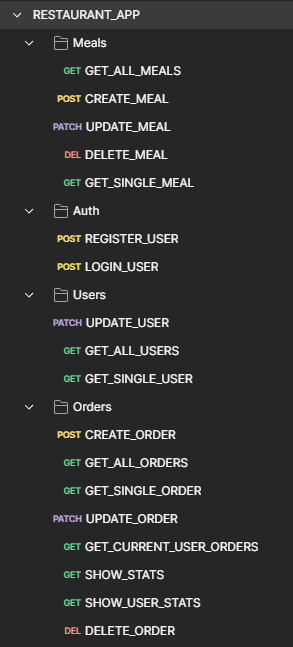

## Italian Food - Restaurant App - REST API

REST API for Italian Food application, which was part of my engineering job.
The API was written in node.js in the express framework.
As a database I used MongoDB Atlas and for debugging api queries I used Postman.

